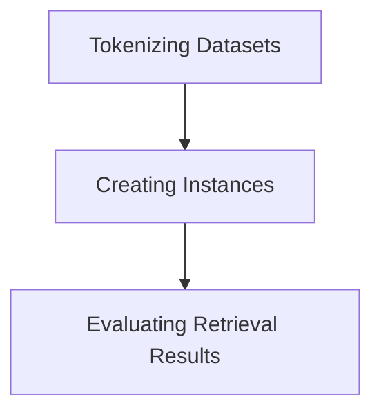

import { Callout, Steps, Step } from "nextra-theme-docs";

# Dataset Creation

The **Dataset Creation** module in the SWEBench project is responsible for generating instances for model training. This involves tokenizing datasets, creating instances based on issue statements and code patches, and evaluating the retrieval results.

The main components of this module are:

1. **Tokenizing Datasets**: Functions for tokenizing text inputs, extracting fields, and adding columns to the dataset.
2. **Creating Instances**: Generating prompts, adding line numbers, and creating code text for model training.
3. **Evaluating Retrieval Results**: Calculating recall metrics for retrieved files compared to gold files.

Let's dive into the details of each component:

## Tokenizing Datasets

The [tokenize_dataset.py](/dataset-creation/tokenizing-datasets) file contains the functions for tokenizing datasets for model training. These functions handle the preprocessing of text inputs, extraction of relevant fields, and the addition of necessary columns to the dataset.

<Callout type="info">
The tokenization process is crucial for preparing the data in a format that can be efficiently processed by the language models. It ensures that the text inputs are properly encoded and structured for training.
</Callout>

## Creating Instances

The [create_instance.py](/dataset-creation/creating-instances) file is responsible for generating instances from issue statements and code patches. This includes functions for:

- Generating prompts: Combining the issue statement and code patch to create a meaningful prompt for the model.
- Adding line numbers: Enhancing the code text by including line numbers for better context.
- Creating code text: Extracting and formatting the code changes from the patches.

The instance creation process is a key step in preparing the data for model training, as it structures the input-output pairs in a way that the model can effectively learn from.

## Evaluating Retrieval Results

The [eval_retrieval.py](/dataset-creation/evaluating-retrieval-results) file is used for evaluating the retrieval results based on document hits and gold files. It calculates the recall metrics, which provide insights into the model's performance in identifying the relevant files.

<Callout type="warning">
Accurate evaluation of retrieval results is crucial for assessing the model's capabilities and identifying areas for improvement. This step helps ensure the quality and reliability of the dataset for model training.
</Callout>

The overall [dataset creation](/dataset-creation) process in the SWEBench project can be summarized in the following diagram:

By leveraging these components, the SWEBench project can effectively prepare the dataset for model training, ensuring that the inputs are properly formatted and the model's performance is thoroughly evaluated.