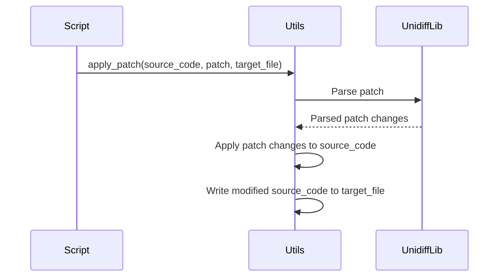

import { Callout, Steps, Step } from "nextra-theme-docs";

# Applying Patches

When evaluating model predictions, it's crucial to apply the generated patches to the test instances and verify the correctness of the patches. The `engine_evaluation.py` script handles this process by setting up the necessary environments, applying the patches, and running the tests.

<Callout type="info">
The application of patches is a crucial step in the evaluation process, as it validates whether the generated code changes can successfully resolve the underlying issue.
</Callout>

## Setting Up Test Environments

Before applying the patches, the script sets up the appropriate test environments. This involves cloning the repository, installing the required dependencies, and preparing the environment for running the tests. The `TestbedContextManager` class is responsible for managing the setup and teardown of these test environments.

<Steps>
### Step 1
The script first clones the repository containing the test instances using the `Repo` class from the `utils.py` module.

### Step 2
Next, it installs the necessary dependencies for the test environment. This is done by fetching the installation configurations from the `constants.py` module and executing the appropriate commands.

### Step 3
Finally, the `TestbedContextManager` class is used to set up the test environment and ensure that it's properly cleaned up after the evaluation is complete.
</Steps>

## Applying Patches

Once the test environment is set up, the script proceeds to apply the generated patches to the test instances. The `apply_patch` function from the `utils.py` module is responsible for this task.

<Steps>
### Step 1
The function takes the original source code, the generated patch, and the target file path as input.

### Step 2
It uses the `unidiff` library to parse the patch and apply the changes to the source code.

### Step 3
The modified source code is then written back to the target file, effectively applying the patch.
</Steps>

## Running Tests

After applying the patches, the script runs the tests on the modified test instances. This is done using the `TaskEnvContextManager` class, which sets up the task-specific environment and executes the test commands.

<Steps>
### Step 1
The `TaskEnvContextManager` class is used to activate the task-specific environment for running the tests.

### Step 2
The script then executes the test commands within the activated environment, capturing the test results and logging any failures or errors.

### Step 3
The test results are processed, and the evaluation metrics are computed based on the outcomes.
</Steps>

The results of the evaluation, including the success or failure of the applied patches, are then logged and reported for further analysis.

By following this process, the `engine_evaluation.py` script ensures that the generated patches are properly applied and tested, providing valuable feedback on the effectiveness of the model predictions.

For more information on the overall evaluation and patching process, you can refer to the [Evaluation and Patching](/evaluation-patching) section.