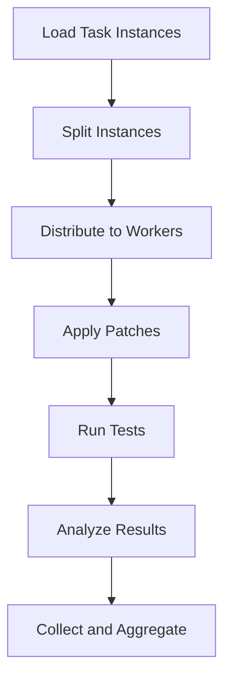

import { Callout, Steps, Step } from "nextra-theme-docs";

# Evaluating Predictions

The `engine_evaluation.py` script plays a crucial role in evaluating the predictions made by your models and applying the generated patches to test instances. This process is essential for assessing the performance of your models and ensuring the patches are effective in resolving the identified issues.

## Setting Up Test Environments

Before we dive into the evaluation process, it's essential to set up the appropriate test environments. The `engine_evaluation.py` script handles this task by cloning the necessary repositories and managing the test environments.

<Callout type="info">
The script uses the `TestbedContextManager` class from the `context_manager.py` file to set up and tear down the test environments.
</Callout>

## Evaluating Predictions

The core functionality of the `engine_evaluation.py` script lies in the evaluation of predictions. The script processes the model outputs and applies the generated patches to the test instances.

<Steps>
### Step 1: Load Test Instances
The script first loads the test instances from the dataset. This includes the problem statements, code patches, and any other relevant information needed for the evaluation.

### Step 2: Apply Patches
Once the test instances are loaded, the script applies the generated patches to the code. This step is crucial to ensure the patches are effective in resolving the identified issues.

### Step 3: Run Tests
After applying the patches, the script runs the tests on the patched code to evaluate the effectiveness of the predictions. The script leverages the `TestbedContextManager` class to set up the appropriate test environments for each instance.

### Step 4: Analyze Results
The final step in the evaluation process is to analyze the test results. The script logs the outcomes, including successful patches, failed patches, and any errors that occurred during the testing process.
</Steps>

By following this structured approach, the `engine_evaluation.py` script ensures a thorough and reliable evaluation of the model predictions. The results of this evaluation can then be used to further refine and improve the models.

## Parallel Processing

To improve the efficiency of the evaluation process, the `engine_evaluation.py` script utilizes parallel processing. It leverages the `multiprocessing` library to distribute the task instances across multiple worker processes.

By parallelizing the task execution, the script can significantly reduce the overall evaluation time, especially when dealing with a large number of test instances.

## Logging and Reporting

Throughout the evaluation process, the `engine_evaluation.py` script provides detailed logging and reporting. It tracks the progress of the evaluation, records the test outcomes, and generates reports for further analysis.

The logging and reporting features are implemented using the `logging` module, which ensures consistent and informative output for debugging and monitoring purposes.

By leveraging the capabilities of the `engine_evaluation.py` script, you can effectively evaluate the performance of your models, identify areas for improvement, and ensure the generated patches are effective in resolving the identified issues. This rigorous evaluation process is a crucial step in the development and refinement of your software engineering models.

[Applying Patches](/evaluation-patching/applying-patches)