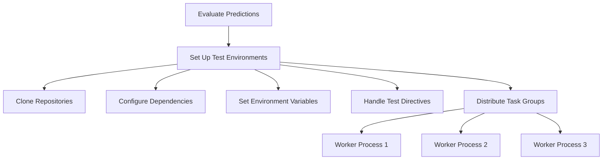

import { Callout, Steps, Step } from "nextra-theme-docs";

# Setting Up Test Environments

The `engine_evaluation.py` script plays a crucial role in setting up the test environments for evaluating the predictions made by your models. This process ensures that the test instances are executed in a controlled and consistent environment, allowing for accurate assessment of the model's performance.

## Cloning Repositories

The first step in setting up the test environments is to clone the necessary repositories. The script utilizes the `GitPython` library to handle the cloning process. This allows you to specify the repository URL and the desired branch or commit to be cloned.

<Callout type="info">
In the context of software engineering, it's essential to ensure that the test environments closely match the real-world deployment environment. This helps identify any issues or incompatibilities that may arise during the deployment process.
</Callout>

## Configuring Test Environments

After cloning the repositories, the script proceeds to configure the test environments. This involves setting up the appropriate dependencies, environment variables, and other configuration settings required for the test instances to run successfully.

<Steps>
### Step 1: Fetching Dependencies
The script uses the `utils.py` module to fetch the required dependencies for the test environment. This includes Python packages, system-level libraries, and any other necessary components.

### Step 2: Configuring Environment Variables
The script ensures that the appropriate environment variables are set for the test environment. This may include variables related to API keys, database connections, or other configuration settings specific to the project.

### Step 3: Handling Test Directives
The script also processes any test directives or configuration files that may be present in the cloned repositories. These directives can provide instructions on how to execute the tests, such as specific commands or test suites to run.
</Steps>

## Parallel Processing of Task Groups

To optimize the evaluation process, the `engine_evaluation.py` script leverages parallel processing using the `multiprocessing` library. It divides the task instances into groups and distributes them across multiple worker processes, allowing for concurrent execution and improved overall performance.

By following this structured approach to setting up the test environments, the `engine_evaluation.py` script ensures that the evaluation process is reliable, consistent, and scalable, allowing you to thoroughly assess the performance of your models.

For more information on the utility functions and context management classes used in this process, please refer to the [Utility Functions](/utility-functions) and [Context Management](/context-management) sections of the documentation.