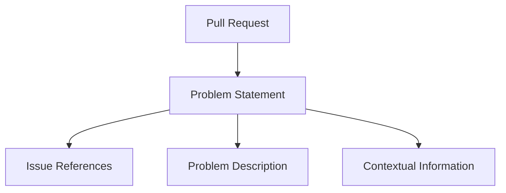

import { Callout, Steps, Step } from "nextra-theme-docs";

# Extracting Problem Statements

Extracting meaningful problem statements from pull requests is a crucial step in the process of creating task instances for the SWEBench dataset. The goal is to distill the essence of the problem or issue that the code change is attempting to address.

Let's dive into the key aspects of this process:

## Identifying Problem Statements

The first step is to identify the problem statement within the pull request. This typically involves scanning the pull request description, issue references, and any accompanying text for concise explanations of the problem or bug that the code change is intended to solve.

<Callout type="info">
The problem statement should be a clear and succinct description of the issue, without going into the technical details of the solution.
</Callout>

## Extracting Relevant Information

Once the problem statement is identified, the next step is to extract the relevant information from the pull request. This includes:

- **Issue References**: Any references to existing issues or bug reports that the pull request is addressing.
- **Problem Description**: The textual description of the problem or issue, as provided in the pull request.
- **Contextual Information**: Any additional context, such as expected vs. actual behavior, that helps to understand the problem.

## Validating and Filtering

After extracting the relevant information, it's important to validate the quality and relevance of the problem statement. This can involve checking for the following:

- **Clarity**: Is the problem statement clear and unambiguous?
- **Specificity**: Does the problem statement focus on a specific issue, rather than being too broad or general?
- **Relevance**: Is the problem statement directly related to the code change in the pull request?

<Callout type="warning">
Problem statements that are vague, overly broad, or not directly relevant to the code change may need to be filtered out or further refined before being included in the dataset.
</Callout>

## Example

As an example, let's consider the following pull request:

In this case, the problem statement might be:

> "The `save()` method in the `FileManager` class fails to handle file permissions correctly, resulting in failed file saves in certain scenarios."

The relevant information extracted would be:

- **Issue References**: #42, #58
- **Problem Description**: The `save()` method in the `FileManager` class is not properly handling file permissions, leading to failed file saves.
- **Contextual Information**: This issue occurs in certain scenarios where the user does not have the necessary permissions to write to the target file.

By following this process, you can effectively extract meaningful problem statements from pull requests and build a high-quality dataset for the SWEBench project.

[Go to Creating Instances](/instance-creation-pull-requests/creating-instances-pull-requests)