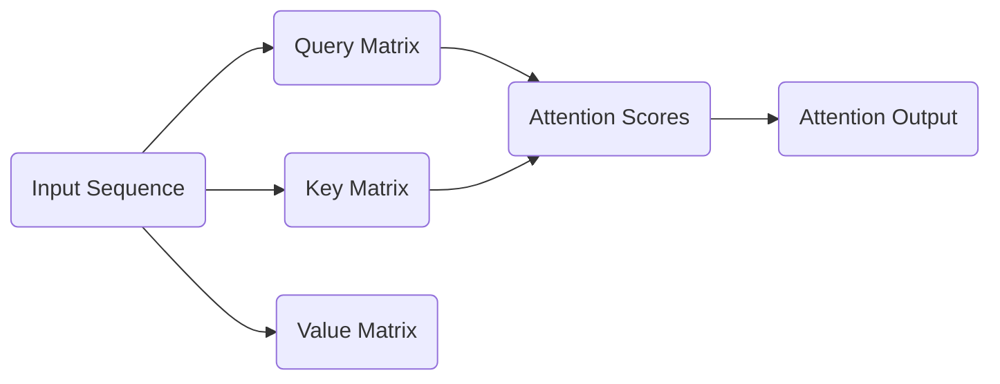

import { Callout, Steps, Step } from "nextra-theme-docs";

# Attention Mechanism

The attention mechanism is a core component of the LLaMA model architecture, enabling the model to focus on the most relevant parts of the input sequence during the generation process. This section delves into the implementation details of the attention mechanism used in the LLaMA model.

## Understanding Attention

The attention mechanism is a fundamental technique used in modern neural network architectures, such as transformers, to improve the model's ability to capture long-range dependencies and focus on the most relevant parts of the input. In the context of language models, the attention mechanism allows the model to assign different weights to different parts of the input sequence, enabling it to better understand the context and generate more coherent and relevant output.

<Callout type="info">
The attention mechanism in the LLaMA model is based on the classic [Attention is All You Need](https://arxiv.org/abs/1706.03762) paper, which introduced the transformer architecture.
</Callout>

## Attention Computation

The attention mechanism in the LLaMA model is implemented using the following steps:

<Steps>
### Step 1: Compute the Query, Key, and Value Matrices
The input sequence is first transformed into three matrices: the **Query** matrix, the **Key** matrix, and the **Value** matrix. These matrices are computed using linear transformations of the input embeddings.

### Step 2: Compute the Attention Scores
The attention scores are computed by taking the dot product of the Query matrix and the transpose of the Key matrix, and then applying a softmax function to the result. This operation determines how much attention should be paid to each part of the input sequence.

### Step 3: Compute the Attention Output
The attention output is computed by taking the dot product of the attention scores and the Value matrix. This weighted sum of the input values represents the most relevant information for the current output.
</Steps>

The mathematical representation of the attention mechanism can be expressed as follows:

$$
\text{Attention}(Q, K, V) = \text{softmax}\left(\frac{QK^T}{\sqrt{d_k}}\right)V
$$

where $Q$ is the Query matrix, $K$ is the Key matrix, $V$ is the Value matrix, and $d_k$ is the dimensionality of the key vectors.

## Attention Visualization

To better understand the attention mechanism, it can be helpful to visualize the attention weights. Here's an example of how the attention weights might look for a sample input sequence:

In this visualization, the thickness of the arrows represents the relative importance of the attention weights, allowing you to see which parts of the input sequence the model is focusing on for a particular output.

## Attention Heads and Multi-Head Attention

The LLaMA model, like many transformer-based models, employs the concept of **attention heads**. Each attention head computes the attention scores independently, allowing the model to capture different types of relationships and dependencies in the input sequence.

The final attention output is then obtained by concatenating the outputs of all the attention heads and applying a linear transformation. This technique, known as **multi-head attention**, enables the model to learn more complex representations and capture a wider range of relevant information from the input.

By using multiple attention heads, the LLaMA model can attend to different aspects of the input sequence, leading to improved performance on a variety of language tasks.

## Conclusion

The attention mechanism is a crucial component of the LLaMA model architecture, enabling the model to focus on the most relevant parts of the input sequence during the generation process. Understanding the inner workings of the attention mechanism, including the computation of attention scores and the use of multiple attention heads, is essential for understanding the capabilities and limitations of the LLaMA model. As you continue to explore and work with the LLaMA model, keep the attention mechanism in mind as a key to unlocking its full potential.

For more information on the LLaMA model architecture, you can refer to the [LLaMA Model Architecture](/llama-model-architecture) section.