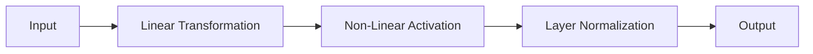

import { Callout, Steps, Step } from "nextra-theme-docs";

# MLP Layers

The LLaMA model architecture, defined in the `llamao` module, utilizes Multilayer Perceptron (MLP) layers as an essential component. These MLP layers play a crucial role in the model's ability to learn complex representations and perform effective text generation.

## Overview of MLP Layers

The MLP layers in the LLaMA model consist of a series of fully connected neural network layers. These layers take the output from the attention mechanism and apply a series of linear transformations, non-linear activations, and layer normalizations to produce the final output.

<Callout type="info">
The MLP layers in the LLaMA model are responsible for processing and transforming the input data, enabling the model to capture higher-level features and patterns.
</Callout>

## Structure of MLP Layers

The MLP layers in the LLaMA model are structured as follows:

1. **Linear Transformation**: The input is first passed through a linear layer, which applies a weighted sum of the input features to produce a new set of features.
2. **Non-Linear Activation**: After the linear transformation, a non-linear activation function, such as the Gaussian Error Linear Unit (GeLU), is applied to introduce non-linearity and enable the model to learn complex relationships.
3. **Layer Normalization**: To stabilize the training process and improve the model's performance, layer normalization is applied to the output of the non-linear activation. This helps to maintain a consistent distribution of activations throughout the network.

The diagram below illustrates the structure of the MLP layers in the LLaMA model:

## Importance of MLP Layers

The MLP layers in the LLaMA model serve several important functions:

1. **Feature Extraction**: The linear transformation and non-linear activation enable the model to extract higher-level features from the input data, which are crucial for effective text generation.
2. **Non-Linearity**: The inclusion of non-linear activations allows the model to learn complex, non-linear relationships in the data, which is essential for capturing the nuances of natural language.
3. **Stabilization**: The layer normalization helps to stabilize the training process and improve the model's performance by maintaining a consistent distribution of activations throughout the network.

<Callout type="tip">
The MLP layers in the LLaMA model work in conjunction with the attention mechanism to provide a powerful and flexible architecture for text generation tasks.
</Callout>

## Customizing MLP Layers

The LLaMA model's MLP layers can be customized to suit specific requirements or optimize performance. Some potential areas of customization include:

- **Layer Configuration**: The number of MLP layers, the dimensionality of the linear transformations, and the choice of activation functions can be adjusted to find the optimal configuration for a particular task or dataset.
- **Initialization**: The initial weights and biases of the MLP layers can be customized to improve convergence and stability during training.
- **Regularization**: Techniques like dropout or weight decay can be applied to the MLP layers to prevent overfitting and improve the model's generalization capabilities.

By understanding the role and structure of the MLP layers in the LLaMA model, you can better optimize and fine-tune the model for your specific natural language processing requirements.