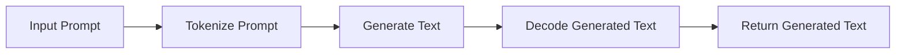

import { Callout, Steps, Step } from "nextra-theme-docs";

# Loading LLaMA Model

The `run_llama.py` script is responsible for loading the LLaMA model and tokenizer, which are essential components for generating text using the LLaMA language model. Let's dive into the details of how this process works.

## Setting Up the Environment

The first step in loading the LLaMA model is to ensure that the necessary dependencies are in place. The script imports several third-party libraries, including `transformers`, `datasets`, `torch`, `tqdm`, and a custom class `PeftModel`. These libraries are used for various purposes, such as loading the model and tokenizer, processing datasets, and handling tensor operations.

<Callout type="info">
The `transformers` library provides a standardized interface for loading and using pre-trained language models, including the LLaMA model.
</Callout>

## Loading the Model and Tokenizer

The `run_llama()` function is the entry point for the text generation process. Within this function, the script loads the LLaMA model and tokenizer using the `transformers` library. Here's how it's done:

<Steps>
### Step 1
The script loads the LLaMA model by calling the `AutoModelForCausalLM.from_pretrained()` function from the `transformers` library. This function takes the path to the pre-trained LLaMA model as an argument and returns the loaded model.

### Step 2
The script then loads the LLaMA tokenizer by calling the `AutoTokenizer.from_pretrained()` function from the `transformers` library. This function takes the same path to the pre-trained LLaMA model and returns the corresponding tokenizer.

### Step 3
If the PEFT (Parameter-Efficient Fine-Tuning) adapter is available, the script loads it using the `PeftModel` class. The PEFT adapter can be used to fine-tune the LLaMA model on specific tasks without modifying the original model weights.
</Steps>

## Preparing for Text Generation

After loading the model and tokenizer, the script sets up the necessary configurations for text generation. This includes:

- Determining the device (CPU or GPU) to be used for the model inference.
- Checking if the model and tokenizer have been properly loaded and configured.
- Setting the generation parameters, such as the maximum length of the generated text and the temperature (a parameter that controls the randomness of the generated text).

## Generating Text with the LLaMA Model

The `generate()` function is responsible for the actual text generation process using the loaded LLaMA model and tokenizer. Here's a high-level overview of how it works:

1. The input prompt is first tokenized using the loaded tokenizer.
2. The tokenized prompt is then passed to the `generate()` method of the LLaMA model, which generates the text based on the input.
3. The generated text is then decoded using the tokenizer to produce the final output.
4. The generated text is returned as the output of the `generate()` function.

By following this process, the `run_llama.py` script is able to leverage the power of the LLaMA language model to generate text based on the provided input prompts.

## Handling Errors and Exceptions

The script also includes error handling and exception management to ensure that the text generation process is as robust as possible. For example, if there are any issues with loading the model or tokenizer, or if the input prompt is not compatible with the model, the script will handle these cases gracefully and provide appropriate error messages.

Overall, the `run_llama.py` script provides a well-structured and efficient way to load and use the LLaMA language model for text generation tasks within the SWEBench project. By understanding the key components and steps involved in this process, you can gain a deeper appreciation for the underlying architecture and implementation details of the SWEBench system.