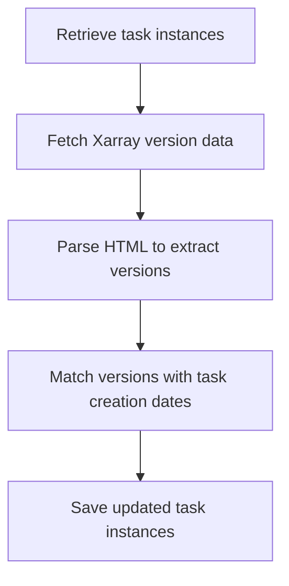

import { Callout, Steps, Step } from "nextra-theme-docs";

# Extracting Xarray Versions

The `get_versions_xarray.py` file is responsible for extracting version information for the Xarray library. This module plays a crucial role in the versioning process, ensuring that task instances are accurately associated with the corresponding Xarray library versions.

## Purpose and Functionality

The primary purpose of this module is to retrieve version data for the Xarray library from a specific webpage, match it with the creation dates of task instances, and then save the updated task instances with the appropriate version information.

This process involves the following key steps:

1. Retrieving task instances from a specified path.
2. Fetching version data from a webpage related to the Xarray library.
3. Parsing the HTML content of the webpage to extract the version information.
4. Matching the extracted version data with the task creation dates to assign versions to the tasks.
5. Saving the updated task instances with the version information to a specified path.

By automating this versioning process, the SWEBench project ensures that the task instances are accurately labeled with the corresponding library versions, which is crucial for maintaining the integrity and reliability of the dataset.

## Third-Party Libraries

The `get_versions_xarray.py` file utilizes the following third-party libraries:

- `requests`: Used for making HTTP requests to retrieve the webpage content containing the Xarray version data.
- `datetime`: Utilized for date and time manipulation operations, which are necessary for matching the version data with task creation dates.

These libraries provide the necessary functionality to interact with the web, parse the HTML content, and handle date-related operations, all of which are essential for the versioning process.

## Data Flow

The data flow within the `get_versions_xarray.py` file can be illustrated using the following diagram:



1. The script retrieves the task instances from a specified path, providing the necessary data for the versioning process.
2. It then fetches the version data from a webpage related to the Xarray library, using the `requests` library to make the HTTP request.
3. The HTML content of the webpage is parsed to extract the relevant version information, leveraging the capabilities of the HTML parsing library.
4. The extracted version data is then matched with the task creation dates to assign the appropriate versions to the task instances.
5. Finally, the updated task instances with the version information are saved to a specified path, ensuring the dataset is accurately versioned.

## Potential Improvements

While the `get_versions_xarray.py` file effectively extracts version information for the Xarray library, there are a few areas where improvements can be made:

1. **Robust Date Parsing Mechanism**: The current implementation relies on the `datetime` library for date and time manipulation, which may not be able to handle all possible date formats encountered in the version data. Implementing a more robust date parsing mechanism could improve the accuracy and reliability of the version matching process.

2. **Enhanced Version Matching Algorithm**: The version matching algorithm used in the current implementation could be further improved to enhance the accuracy of the version assignment. This may involve exploring more sophisticated techniques for matching version data with task creation dates.

3. **Error Handling and Logging**: Implementing more comprehensive error handling and logging mechanisms can improve the overall robustness and debuggability of the versioning process, especially in cases where the webpage structure or content changes unexpectedly.

By addressing these potential improvements, the `get_versions_xarray.py` module can be further enhanced to provide more reliable and accurate version information for the Xarray library, ultimately contributing to the overall quality and integrity of the SWEBench dataset.

## Example Usage

To use the `get_versions_xarray.py` module, you can follow these steps:

<Steps>
### Step 1
Import the necessary functions from the module:

```python
from get_versions_xarray import fetch_xarray_versions, match_versions_with_tasks
```

### Step 2
Retrieve the task instances from a specified path:

```python
task_instances = load_task_instances('/path/to/task/instances')
```

### Step 3
Call the `fetch_xarray_versions` function to fetch the version data:

```python
xarray_versions = fetch_xarray_versions()
```

### Step 4
Match the version data with the task instances using the `match_versions_with_tasks` function:

```python
updated_task_instances = match_versions_with_tasks(task_instances, xarray_versions)
```

### Step 5
Save the updated task instances with the version information:

```python
save_task_instances(updated_task_instances, '/path/to/save/updated/instances')
```
</Steps>

By following these steps, you can leverage the `get_versions_xarray.py` module to extract and assign the appropriate Xarray library versions to your task instances, ensuring the dataset is accurately versioned.